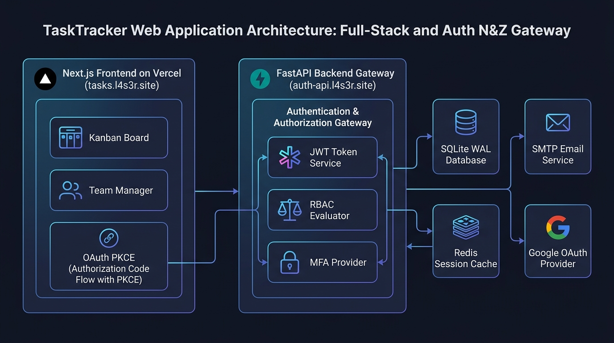
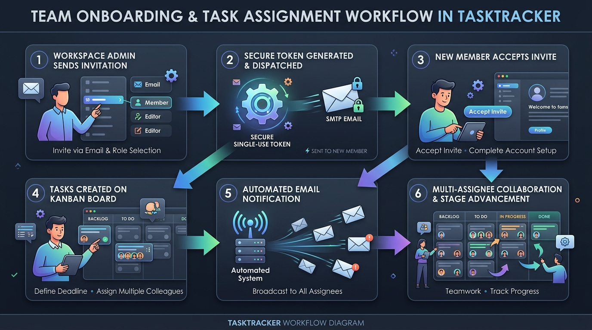
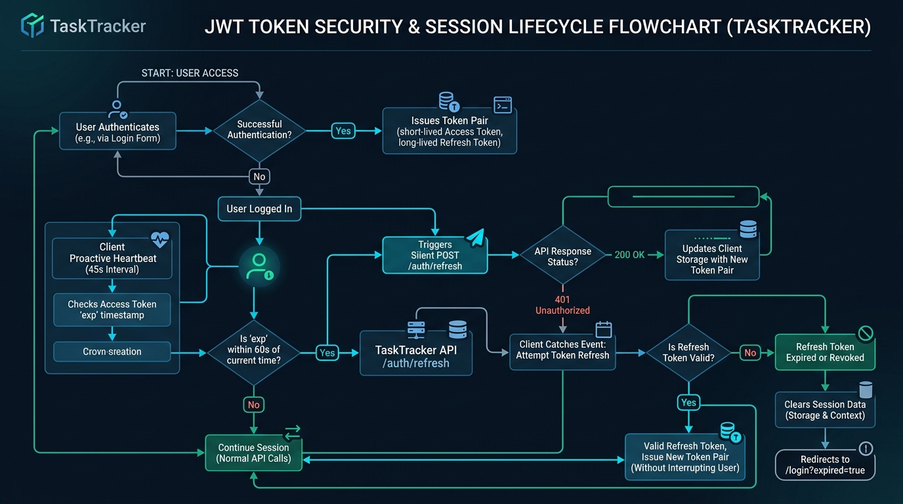

# TaskTracker - Team and Personal Project Workspace

A modern, high-performance web application for sprint planning, Kanban deliverables tracking, group colleague assignment, and automated onboarding workflows. Secured by the **Auth N&Z** authentication, authorization, and multi-factor identity gateway.

---

## 1. System Architecture



### Core Technologies:
- **Framework:** Next.js 14 (App Router), React 18, TypeScript.
- **Styling:** Tailwind CSS, Lucide Icons, dynamic brand vector favicon (`/favicon.svg`).
- **Security:** Auth N&Z REST Gateway (`https://auth-api.l4s3r.site`), JWT silent refresh, proactive expiration heartbeats, Google OAuth 2.0 with PKCE.

---

## 2. Key Features

### Kanban Task Board & Deliverable Tracking
- 4-stage Kanban workflow: **To Do**, **In Progress**, **In Review**, and **Completed**.
- Priority badges (**Low**, **Medium**, **High**, **Urgent**) and instant stage progression.
- Target deadline scheduling with dynamic urgency badges (**Overdue by Xd**, **Due Today**, **Due in Xd**).
- Multi-criteria search and filter by priority, deadline status, assignees, or tags.

### Group / Multi-Assignee Collaboration
- Assign tasks to single members or multiple colleagues simultaneously.
- Overlapping multi-avatar stacks on Kanban cards (up to 3 photos + `+N` badge) with hover details.
- Real-time automated email notifications delivered to all assigned colleagues upon task creation or assignment.

### Interactive Task Details Modal
- Full requirement descriptions with inline editing.
- Assigner username and profile picture display (`Assigned By: Ahmed ...`).
- In-app confirmation dialog for safe task deletion.

### Team Workspace Management
- Real-time roster table with member avatars, access roles, and invitation status.
- Simplified email-only invitation dispatch with secure token generation.
- Full client onboarding flow at `/invite/accept?token=...`.
- Optimistic member removal with immediate backend session revocation.

### Session Security & Auto-Logout
- **Proactive Heartbeat:** Silent token refresh every 45s (and upon tab focus).
- **Reactive 401 Interception:** Immediate silent recovery on unauthorized API responses.
- **Automatic Logout:** Clears local storage and redirects to `/login?expired=true` when refresh tokens expire.

---

## 3. Team Onboarding & Task Assignment Workflow



---

## 4. JWT Token Security & Session Lifecycle



---

## 5. Getting Started

### 1. Installation

```bash
cd "C:\Users\Lenovo\Documents\task-tracker"
npm install
```

### 2. Environment Configuration

Create or edit `.env.local`:

```env
# Auth N&Z Backend API Gateway
NEXT_PUBLIC_AUTH_API_URL=https://auth-api.l4s3r.site

# For local development with backend running on port 8000:
# NEXT_PUBLIC_AUTH_API_URL=http://localhost:8000
```

### 3. Development Server

```bash
npm run dev
```

Open `http://localhost:3000` in your browser.

### 4. Production Build

```bash
npm run build
npm start
```

---

## 6. Deploying to Vercel

1. **Commit and Push Changes to GitHub:**
   ```bash
   git add .
   git commit -m "Complete TaskTracker production release"
   git push origin main
   ```

2. **Import Repository in Vercel:**
   - Go to [Vercel Dashboard](https://vercel.com/new).
   - Select your repository (`task-tracker`).
   - In **Environment Variables**, add:
     ```text
     NEXT_PUBLIC_AUTH_API_URL = https://auth-api.l4s3r.site
     ```
   - Click **Deploy**.

3. **Configure Custom Subdomain:**
   - In **Project Settings** &rarr; **Domains**, add your custom domain (e.g. `tasks.l4s3r.site`).
   - In Cloudflare DNS, add a `CNAME` record:
     - **Name:** `tasks`
     - **Target:** `cname.vercel-dns.com`
     - **Proxy status:** DNS Only (or Proxied).

---

## 7. Project Structure

```text
src/
├── app/
│   ├── layout.tsx             # Root layout with AuthProvider and metadata icons
│   ├── icon.tsx               # Dynamic App Router favicon generator
│   ├── page.tsx               # Main Dashboard with Kanban board
│   ├── login/page.tsx         # Sign in with password & Google OAuth
│   ├── register/page.tsx      # Public user registration
│   ├── team/page.tsx          # Team member roster & email invitation modal
│   ├── settings/page.tsx      # MFA setup & active session revocation
│   ├── invite/accept/page.tsx # Client invitation acceptance & onboarding
│   └── auth/callback/page.tsx # OAuth2 PKCE callback handler
├── components/
│   ├── ui/                    # Primitives (button, input, card, badge, modal, avatar, confirm-dialog)
│   └── patterns/              # Features (task-board, task-modal, task-detail-modal, team-manager)
├── lib/
│   ├── api.ts                 # Auth N&Z REST client & 401 unauthorized interceptor
│   ├── auth-context.tsx       # Auth context, silent refresh, & auto-logout
│   ├── tasks-store.ts         # Task & team data models
│   └── utils.ts               # Class name merging utilities
└── styles/
    └── globals.css            # Semantic design tokens and responsive base styles
```
